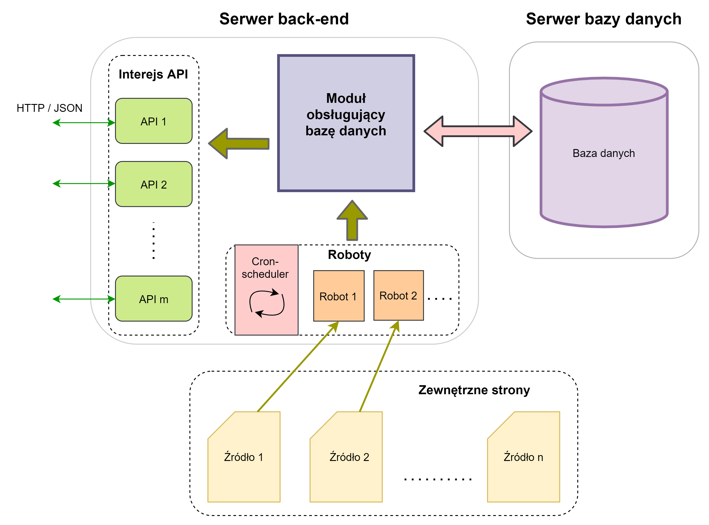
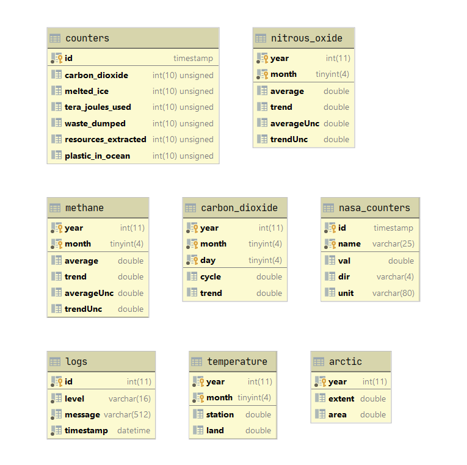

# Climate-site server backend

## 1.  Package installation
	npm install

## 2.  Run the server from terminal
    npm run serve

## 3.  How to use pm2 to handle the life-cycle of the server 
    - pm2 start server.js --name backend --watch
    - pm2 reload backend
    - pm2 stop backend
    - pm2 delete backend 
